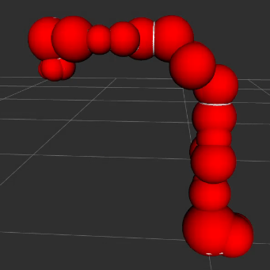
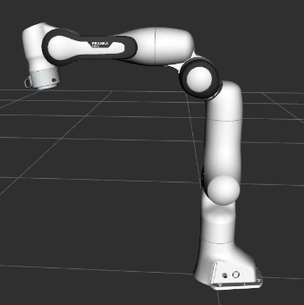
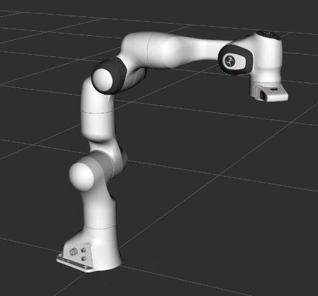

# SpherizedURDFGenerator
An automatic C++ only tool for generating spherized / convex version of collision geometry and write URDF automatically. 

# Introduction

## Spherized

Specifically, the term `Spherized` refers to sphere tree approximated collision.

Notice: the following steps are adopted to generate a spherized version

1. Watertight check (if not watertight, one will be generated)
2. Simplify (Optional; using `igl:decimate` to down-sample surfaces into 30%)
3. Spherized Version Generation(Several hyper-parameters can be tuned. See `config/sphereTree/sphereTreeConfig.yml`)

​				 

## Convex

Specifically, the term `Convex` refers to convex hull approximated collision.

Notice: `cgal::convex_hull()` are used.

​				

## URDF

We only accept `stl` & `obj` file for raw collision meshes; All generated meshes are stored in `obj` file. 

All elements and formats are followed. The generated URDF file will **only** modify the collision element. For `Spherized` version, several or only one sphere are added; For `Convex` version, the collision mesh will be generated, stored and correctly referred. 

We **only** accept  and generate URDF as `.urdf`. If a `.xacro` is utilized, please refer to some other tools like (`pip install xacro`)

`python -m xacro your_file.urdf.xacro -o output_file.urdf`

# Dependencies

This package relies on binary-distributed libraries:

- [cgal](https://github.com/CGAL/cgal?tab=License-1-ov-file)
- [urdfdom](https://github.com/ros/urdfdom)
- [yaml-cpp](https://github.com/jbeder/yaml-cpp)
- [tinyxml2](https://github.com/leethomason/tinyxml2)
- gmp

Fortunately, they can be installed through simple `apt-get` process.  

```shell
sudo apt-get install libcgal-dev liburdfdom-dev libyaml-cpp-dev libtinyxml2-dev libgmp-dev
```

The distribution also contains the following sources from other people (all are introduced in a header-only manner):

- [libigl](https://github.com/libigl/libigl)
- [sphere_tree](https://github.com/mlund/spheretree)
- [ManifoldPlus](https://github.com/hjwdzh/ManifoldPlus)
- [cmake-template](https://github.com/cpp-best-practices/cmake_template/tree/main)

This work is built on the basis of those fantastic works. We thank all the aforementioned open-source project for the help of the implementations.

This work also relies on self-maintained pkg `irmv_core`, users could obtain the newest version from the **release** page in this repo.
One can install it with simply

```shell
cd ~ && git clone https://github.com/PREDICT-EPFL/piqp.git
cd piqp
mkdir build && cd build
cmake .. -DCMAKE_CXX_FLAGS="-march=native" -DBUILD_TESTS=OFF -DBUILD_BENCHMARKS=OFF
make -j8
sudo make install
cd ~ && rm -rf piqp

cd ~ && git clone https://github.com/SergiusTheBest/plog.git
cd plog && mkdir build
cd build && cmake ..
make && sudo make install
cd ~ && sudo rm -rf ./plog

sudo dpkg -i install irmv_core-xxx--Linux-Release-GNU-9.4.0.deb
```

One can simply remove it with `sudo dpkg -r irmv_core`.

# Compile

```shell
git submodule update --init --recursive
cmake -B build . -DCMAKE_BUILD_TYPE=Release
cmake --build build 
```

# Usage

## Spherized

```shell
cd build && ./spherized -i <input_urdf_path> -o <output_urdf_path> [-r <key> <value> ...] [--simplify <0|1>]
```

- `-i <input_urdf_path>`: Specifies the path to the input URDF file.

- `-o <output_urdf_path>`: Specifies the path to the output URDF file.

- `-r <key> <value>`: Specifies replacement pairs. You can use multiple `-r` options to define several key-value pairs that will be replaced in the URDF file.   

  ​	**An useful replacement pair for ROS is “package:/” “/home/xxx/xxx_ws/src”. ** This will help this program to replace the original “package://yyy/mesh/zzz.stl” into “/home/xxx/xxx_ws/src/yyy/mesh/zzz.stl” to correctly find the mesh file without ROS. Meanwhile, the generated URDF will generate the mesh URL using the original format like “package:/yyy/mesh/zzz.obj”. So it can be directly valid for ROS

- `--simplify <0|1>`: Indicates whether to simplify the URDF generation process. Use `1` to enable and `0` to disable.

## Convex

```shell
cd build && ./convex -i <input_urdf_path> -o <output_urdf_path> [-r <key> <value> ...]
```

- `-i <input_urdf_path>`: Specifies the path to the input URDF file.

- `-o <output_urdf_path>`: Specifies the path to the output URDF file.

- `-r <key> <value>`: Specifies replacement pairs. You can use multiple `-r` options to define several key-value pairs that will be replaced in the URDF file.   

  ​	**An useful replacement pair for ROS is “package:/” “/home/xxx/xxx_ws/src”. ** This will help this program to replace the original “package://yyy/mesh/zzz.stl” into “/home/xxx/xxx_ws/src/yyy/mesh/zzz.stl” to correctly find the mesh file without ROS. Meanwhile, the generated URDF will generate the mesh URL using the original format like “package:/yyy/mesh/zzz.obj”. So it can be directly valid for ROS.

## Parameters Tuning

​	See config files in `config/sphereTree/sphereTreeConfig.yml`

## Example

We use [franka](https://github.com/justagist/franka_panda_description) to test.

### Preprocess

Warning: One should replace (in`robots/panda_arm.urdf`)

```xml
<collision>
      <geometry>
        <mesh filename="/meshes/collision/xxx.stl"/>
      </geometry>
</collision>
```

into

```xml
<collision>
      <geometry>
        <mesh filename="package://franka_panda_description/meshes/collision/xxx.stl"/>
      </geometry>
</collision>
```

### Spherized

```shell
cd build && ./sphereized -i /home/zyx/path_ws/src/franka_panda_description/robots/panda_arm.urdf -o /home/zyx/path_ws/src/franka_panda_description/robots/panda_arm_spherized.urdf -r "package:" "/home/zyx/path_ws/src" --simplify 1
```

### Convex

```shell
cd build && ./convex -i /home/zyx/path_ws/src/franka_panda_description/robots/panda_arm.urdf -o /home/zyx/path_ws/src/franka_panda_description/robots/panda_arm_spherized.urdf -r "package:" "/home/zyx/path_ws/src"
```

# Citation

If this lib helps your research, please cite us

```latex
@misc{ZHOU2024SpherizedURDF,
    title={{SpherizedURDF: An automatic C++ tool for generating spherized / convex version of collision geometry and write URDF automatically}}, 
    author={Zhou, Yixuan and Wang, Hesheng}, 
    year={2024},
    url={https://github.com/IRMV-Manipulation-Group/SpherizedURDFGenerator}
}
```

