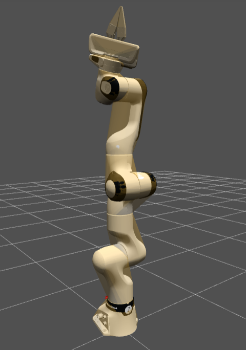
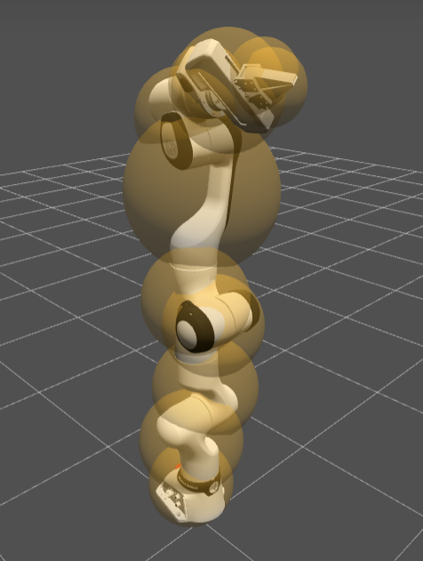
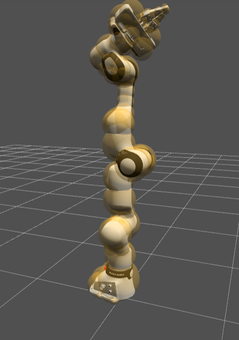
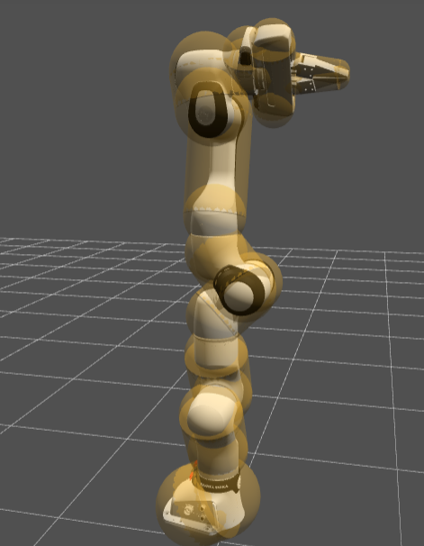
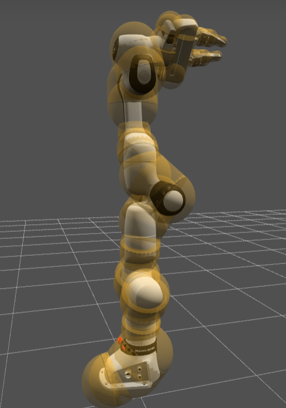

# URDFApproxGeom

URDFApproxGeom converts mesh-based URDF collision geometry into lighter collision approximations — **convex meshes**, **sphere trees**, or **capsules** — and emits a JSON sidecar of the fitted primitive parameters alongside a drop-in collision URDF.

| Mode | Output | Best For |
|------|--------|----------|
| `convex` | convex collision meshes in URDF | tight mesh-based collision with low authoring effort |
| `sphere` | sphere primitives in URDF plus JSON sidecar | simulators and planners that prefer simple primitives |
| `capsule` | capsule parameters in JSON sidecar and URDF-compatible primitive representation | smooth low-count robot-link approximations |

## Why use this

- **Sidecar JSON, not just a URDF.** Every primitive is recorded with its analytic parameters — sphere `center`/`radius`, capsule `p0`/`p1`/`radius`. That gives you the closed-form geometry directly, so the output is reusable for analytic collision/distance computation, swept-volume, calibration, and collision-atlas work — not only for dropping into a simulator.
- **Full Python bindings.** The C++ generators are exposed through pybind11, so `generate`/`generate_all` run inline in Python pipelines and notebooks — no subprocess shelling.
- **Three modes, one tool.** Convex / sphere / capsule from a single URDF input, with named presets per mode and a `compare-all` bundle that exports every variant for side-by-side viewing.
- **Inspectable results.** Built-in `validate` and `compare` report tightness metrics (`capV/aabb`, `r/binMed`, `vol/dae`) so you can iterate toward a defensible approximation instead of guessing.

## Visual: ground-truth mesh vs approximations

Each screenshot shows the FR3 `link0` `.dae` visual mesh (wireframe) with the generated collision primitives overlaid. Collision geometry is in solid colour.

| `convex` hull | `sphere` single | `sphere` default | `capsule` single | `capsule` high_detail |
|:-:|:-:|:-:|:-:|:-:|
|  |  |  |  |  |

For a live side-by-side comparison drag the **[pre-bundled FR3 compare directory](assets/fr3_compare_bundle/)** into [robot_viewer](https://github.com/fan-ziqi/robot_viewer) (or run `compare-all` yourself — see [Bundle compare view](#bundle-compare-view)). Toggle **Visual / Collision** to judge every approximation against the `.dae` ground truth.

## Quickstart (Docker)

The published image is the fastest path — no build step, the `urdf-approx-geom` CLI is the entrypoint.

```bash
docker pull irmv-docker-hub-registry.cn-shanghai.cr.aliyuncs.com/manipulation/urdfapprox:1.5.0
docker run --rm -v "$PWD:/workspace" \
  irmv-docker-hub-registry.cn-shanghai.cr.aliyuncs.com/manipulation/urdfapprox:1.5.0 \
  generate --mode all -i /workspace/resources/fr3/urdf/fr3.urdf --output-dir /workspace/out
```

`latest` tracks the newest release. See [Docker environment](#docker-environment) for building the image yourself and using the raw C++ apps.

## Quickstart (from source)

```bash
git submodule update --init --recursive
cmake -B build -DCMAKE_BUILD_TYPE=Release -DCOMPILE_URDFApproxGeom_PYBINDING=ON
cmake --build build -j$(nproc)
PYTHONPATH=$PWD/python:$PWD/build/python python3 -m urdf_approx_geom.cli generate --mode all \
  -i resources/fr3/urdf/fr3.urdf --output-dir /tmp/fr3_approx
```

## Command Line

```bash
# all modes
urdf-approx-geom generate --mode all -i robot.urdf --output-dir out

# one mode
urdf-approx-geom generate --mode capsule -i robot.urdf -o out/robot_capsule.urdf --preset default

# with mesh path replacement (e.g. resolve a package:// prefix)
urdf-approx-geom generate --mode sphere -i robot.urdf -o out.urdf \
  --replace "package://robot" "/home/user/robot"

# custom config (see docs/parameter-tuning.md)
urdf-approx-geom generate --mode capsule -i robot.urdf -o out.urdf --config /tmp/my_capsule.yml

# list presets
urdf-approx-geom presets
```

In a source tree the CLI auto-locates `build/python` for the compiled extension, so `PYTHONPATH=$PWD/python:$PWD/build/python` covers both the package and the extension.

Compare every variant for [robot_viewer](https://github.com/fan-ziqi/robot_viewer):

```bash
urdf-approx-geom compare-all -i robot.urdf --bundle-dir out/compare_bundle
```

This generates convex + sphere (single, default) + capsule (single, default, high_detail), rewrites every mesh path to relative `meshes/<name>`, and copies the meshes into one self-contained directory. To compare two capsule sidecars' metrics in the terminal instead, use `compare --mode capsule` (add `--require-improvement` to fail when the candidate worsens worst `capV/aabb` or `r/binMed`).

## Bundle compare view

`compare-all` produces a self-contained bundle you can inspect without installing anything:

1. Run `compare-all` (above) to produce `out/compare_bundle`.
2. Open **<https://viewer.robotsfan.com/>** in a browser.
3. Drag the whole `compare_bundle` directory onto the page.

Each approximation variant loads as its own URDF; toggle **Visual / Collision** to compare the `.dae` ground truth against every option (convex, sphere presets, capsule presets) side by side.

## Python API

```python
from urdf_approx_geom import generate, generate_all

result = generate("capsule", "robot.urdf", "out/robot_capsule.urdf", preset="default")
print(result.json_path, result.primitive_count)

all_results = generate_all("robot.urdf", "out", modes=["convex", "sphere", "capsule"])
```

## When to use which mode

| Choose | When |
|--------|------|
| **`convex`** | You want the tightest collision shape and your simulator/planner handles convex meshes natively (most do). Lowest authoring effort, best volume accuracy. Pick for final collision meshes. |
| **`sphere`** | Your solver prefers primitive spheres — GPU/contact pipelines, signed-distance via sphere sums, or planners that exploit sphere collision. `single` for the cheapest bounding shape; `default` (medial sphere tree) for tighter multi-sphere coverage. |
| **`capsule`** | You want smooth, low-count analytic primitives with closed-form capsule distance — collision atlases, swept-volume, distance fields, or solvers that benefit from capsule collision. Capsules emit as `<cylinder>` + two `<sphere>` end-caps (urdfdom has no `<capsule>`). |

Quantitative guidance on FR3 arm links (`vol/dae` = approximation volume ÷ `.dae` volume; `.dae` = 1.0, lower is closer to truth):

| Form | Primitives | Worst vol/dae |
|------|-----------:|-------------:|
| `*.dae` visual (reference) | mesh | **1.00** |
| `convex` hull              | mesh | 1.76 |
| capsule `single`           | 11   | 3.65 |
| capsule `default`          | 19   | 5.79 |
| capsule `high_detail`      | 21   | 4.82 |
| sphere `default`           | 80   | 3.57 |
| sphere `single`            | 11   | 11.31 |

`convex` is closest to the `.dae` ground truth (1.76) since a hull hugs the convex envelope. Sphere and capsule primitives are grown to cover every surface point of the true `.dae` visual mesh — which has concavities that the old collision `.stl` smoothed over. This makes sphere fits *tighter* (medial tree hugs concavities better) but capsule fits *looser* (capsules must bridge concavities they cannot enter). The numbers above reflect the default `--mesh-source visual`; pass `--mesh-source collision` for the legacy collision-.stl fit.

## Presets

Capsule: `single` (one conservative capsule/link), `default` (recommended low-count fit), `high_detail` / `tight` (more axial sections and a larger capsule budget; not guaranteed tighter than `default`).
Sphere: `single` (one conservative sphere/link), `default` (medial sphere tree).
Convex: `default` (CGAL convex hull).

For custom tuning — `NSections`, `MaxCapsulesPerLink`, sphere-tree `Method`, `SimplifyRatio`, and the rest — see **[docs/parameter-tuning.md](docs/parameter-tuning.md)**.

## Output Contracts

- `convex`: writes an output URDF whose collision meshes point to generated convex `.obj`/`.dae` meshes.
- `sphere`: writes an output URDF and a JSON sidecar. The canonical per-link field is `spheres`, where each entry has `center` and `radius`. Some legacy sphere-tree outputs may also include `BiggestSphere` and `SubSpheres`; new consumers should read `spheres`.
- `capsule`: writes an output URDF and a JSON sidecar with per-link `capsules`.

Sphere JSON — canonical `spheres` list (`center` + `radius`), plus the legacy `BiggestSphere` entry emitted by multi-sphere fits:

```json
{
  "fr3_link0": {
    "spheres": [
      {"center": [0.0, 0.0, 0.05], "radius": 0.13},
      {"center": [-0.04, 0.0, 0.06], "radius": 0.04}
    ],
    "BiggestSphere": [0.0, 0.0, 0.05, 0.13]
  }
}
```

Capsule JSON — link-frame sphere-center endpoints (`p0` / `p1`):

```json
{
  "link_name": {
    "capsules": [
      {"p0": [0, 0, 0], "p1": [0.1, 0, 0], "radius": 0.03}
    ]
  }
}
```

## Sample Output (FR3)

Geometry accuracy vs the `*.dae` visual meshes in `resources/fr3/meshes/fr3/visual/`, treated as ground truth (`vol/dae` = approximation volume ÷ `.dae` volume; `.dae` = 1.0, lower = closer to the true shape). All rows measured on fr3 arm links link0–link7 (hand/finger links have no `*.dae`):

Sphere and capsule generators fit the `.dae` visual mesh by default (`--mesh-source visual`). The visual `.dae` is the true link shape with concavities; the collision `.stl` files in the input URDF are simplified convex-like envelopes. Fitting the true shape makes medial sphere trees tighter (spheres can nestle into concavities) but capsule fits looser (capsules must bridge concavities they cannot enter). `sphere default` (medial sphere tree, 80 spheres) is the tightest primitive preset overall at 3.57×; `sphere single` is one bounding sphere per link and over-sweeps elongated links the most (11.31×). `capsule single` is one covering capsule per link (11 total); `capsule high_detail` raises the detail ceiling but on FR3 the worst link (link0) stays at 4.82×. For the legacy collision-stl fit use `--mesh-source collision`.

## URDF compatibility

All output URDFs follow the ROS URDF specification — collision geometry is standard `<sphere>`, `<cylinder>`, or `<mesh>` elements with correct origins. The generated URDF **only** modifies the `collision` element; the `visual`, `inertial`, and `joint` elements pass through untouched.

- **Input mesh source:** `convex` reads the `<collision>` elements. `sphere` and `capsule` default to the `<visual>` elements (`--mesh-source visual`) to fit the true geometric shape — `.dae` visuals are auto-converted to `.obj` for the C++ loader. Pass `--mesh-source collision` to fit the collision mesh instead.
- **Input formats:** `.stl` and `.obj` are natively supported; `.dae` visual meshes are converted via the Python pre-pass. The input URDF must carry at least one `<mesh>` element per link (in the appropriate geometry slot).
- **Output:** the generated URDF **only** modifies the `<collision>` element; `<visual>`, `<inertial>`, and `<joint>` elements pass through untouched. Output collision meshes (convex mode) are written as `.obj`.
- If your robot description is in `.xacro`, pre-process it before use — `pip install xacro` then `python -m xacro robot.urdf.xacro -o robot.urdf`.
- URDF `.urdf` is the only accepted and emitted format. Xacro and SDF are not generated.

The generated URDF can be loaded by any URDF-compatible toolchain — RViz, Gazebo, PyBullet, MuJoCo (3.0+), Drake, and ROS `robot_state_publisher`.

## Docker environment

Two ways to get the runtime image.

**Pull the published image** (recommended):

```bash
docker pull irmv-docker-hub-registry.cn-shanghai.cr.aliyuncs.com/manipulation/urdfapprox:1.5.0
# or :latest
```

**Build from the Dockerfile** (multi-stage: a builder compiles C++ + pybind11 and installs to `/usr/local`; a runtime stage copies the install tree and pip-installs the Python package):

```bash
docker build -t urdfapprox -f docker/Dockerfile .
```

**Run.** The entrypoint is `urdf-approx-geom`; mount your data at `/workspace`:

```bash
docker run --rm -v "$PWD:/workspace" urdfapprox \
  generate --mode all -i /workspace/robot.urdf --output-dir /workspace/out

# drop to bash to use the C++ apps directly
docker run --rm -it --entrypoint bash -v "$PWD:/workspace" urdfapprox
/usr/local/bin/spherized -i /workspace/robot.urdf -o /workspace/out.urdf
```

The image bundles the preset `config/` tree (installed under `/usr/local/share/URDFApproxGeom/config`), so both the Python CLI and the C++ apps resolve presets without the source tree.

## Dependencies & Credits

**Binary-distributed** (apt):

```shell
sudo apt-get install libcgal-dev liburdfdom-dev libyaml-cpp-dev libtinyxml2-dev libgmp-dev libeigen3-dev
```

- [CGAL](https://github.com/CGAL/cgal) + [GMP](https://gmplib.org/) — convex-hull computational geometry
- [urdfdom](https://github.com/ros/urdfdom) — URDF parsing/writing
- [yaml-cpp](https://github.com/jbeder/yaml-cpp) — config loading
- [tinyxml2](https://github.com/leethomason/tinyxml2) — XML parsing
- [Eigen](https://eigen.tuxfamily.org/) — linear algebra

**Vendored sources** (header-only under `third_party/`):

- [libigl](https://github.com/libigl/libigl) — geometry processing + the `igl/copyleft/cgal` convex-hull path
- [sphere_tree](https://github.com/mlund/spheretree) — sphere-tree generation
- [ManifoldPlus](https://github.com/hjwdzh/ManifoldPlus) — watertight manifold conversion
- [cmake-template](https://github.com/cpp-best-practices/cmake_template/tree/main) — CMake scaffolding

**Build, bindings & tooling:**

- [irmv_core](https://github.com/IRMV-Manipulation-Group) — self-maintained IRMV core (logger, algorithm factory); bundled in the base Docker image (`imc:base-2.3.0`)
- [pybind11](https://github.com/pybind/pybind11) — Python bindings
- [robot_viewer](https://github.com/fan-ziqi/robot_viewer) — web URDF/MJCF viewer used for the compare bundle

Capsule cross-section decomposition follows the Wu2018 approach. This work is built on the basis of these fantastic projects — thanks to all the maintainers.

## Documentation

- [docs/quickstart.md](docs/quickstart.md)
- [docs/modes.md](docs/modes.md)
- [docs/config-presets.md](docs/config-presets.md)
- [docs/parameter-tuning.md](docs/parameter-tuning.md)
- [docs/python-api.md](docs/python-api.md)
- [docs/output-schema.md](docs/output-schema.md)
- [docs/visualization.md](docs/visualization.md)
- [docs/developer-guide.md](docs/developer-guide.md)

## Citation

```latex
@misc{ZHOU2024SpherizedURDF,
    title={{SpherizedURDF: An automatic C++ tool for generating spherized / convex version of collision geometry and write URDF automatically}},
    author={Zhou, Yixuan and Wang, Hesheng},
    year={2024},
    url={https://github.com/IRMV-Manipulation-Group/SpherizedURDFGenerator}
}
```
